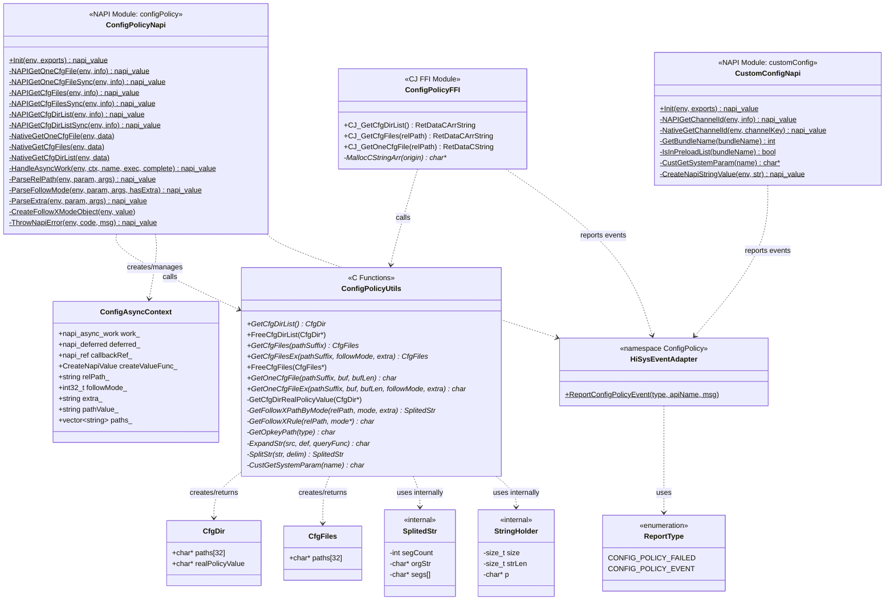
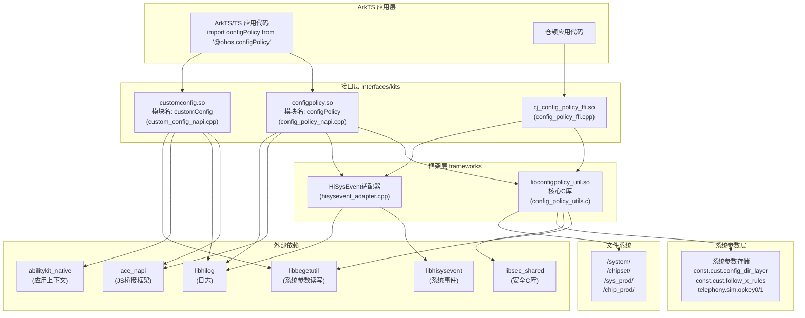
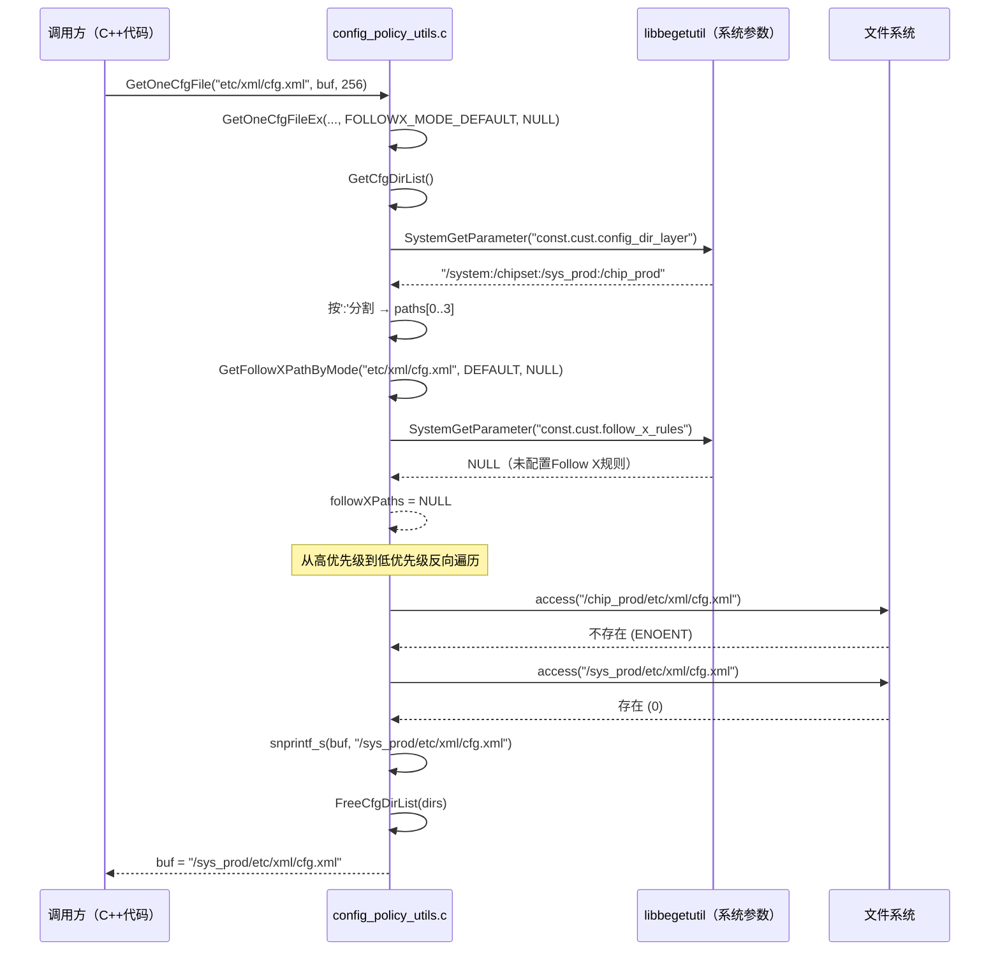
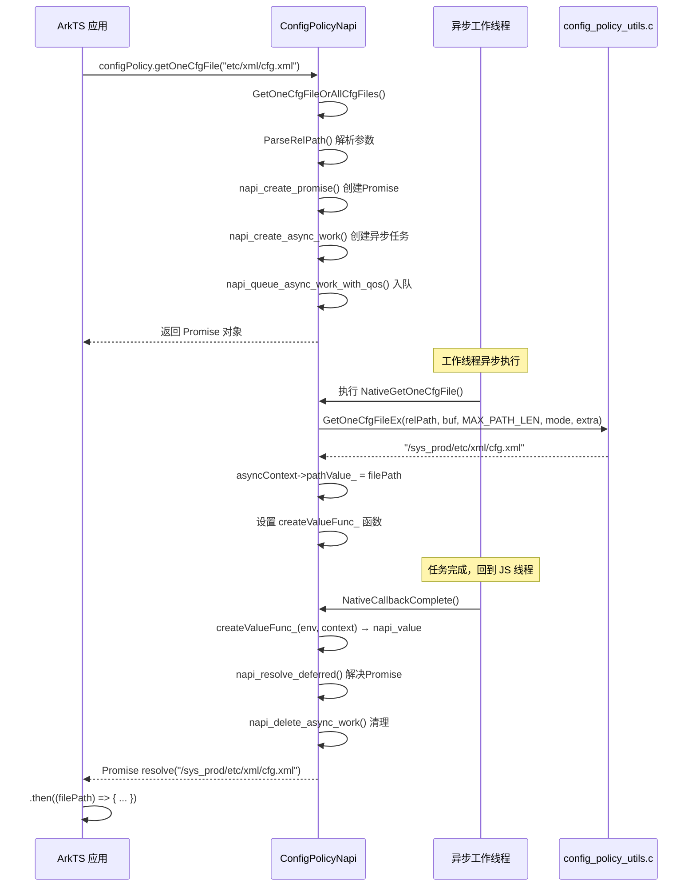
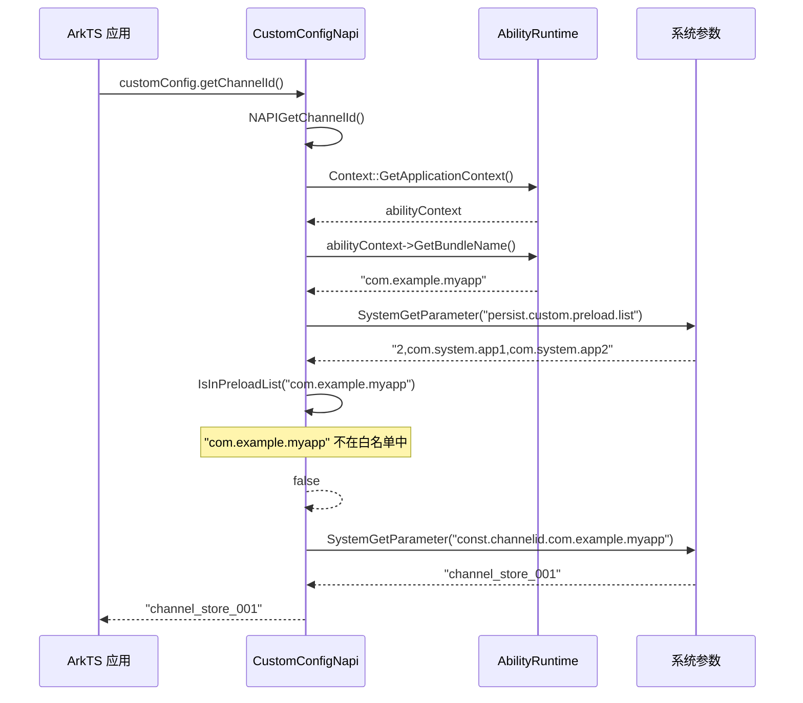
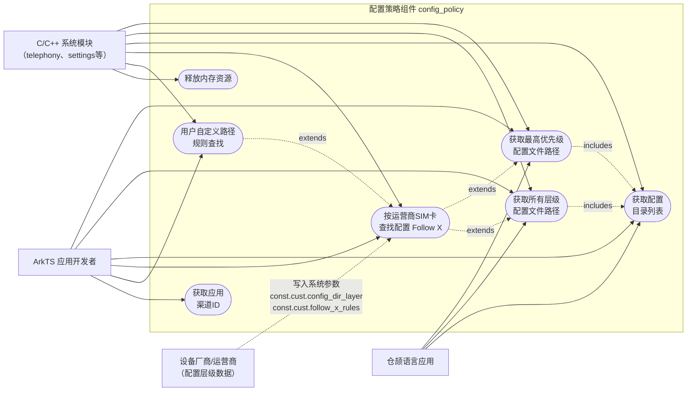
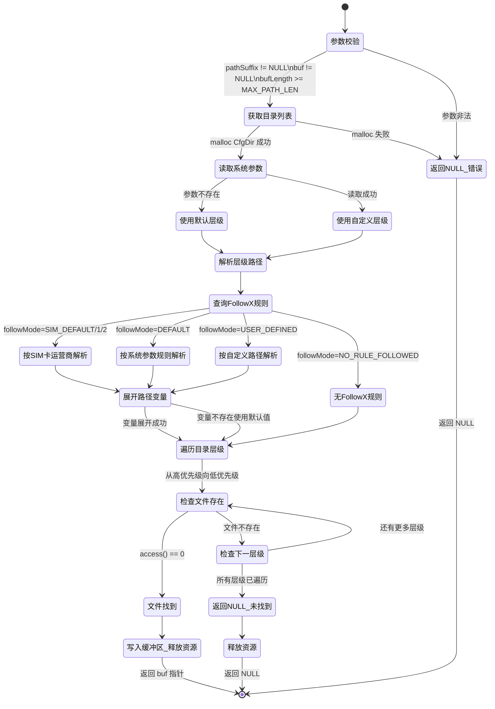
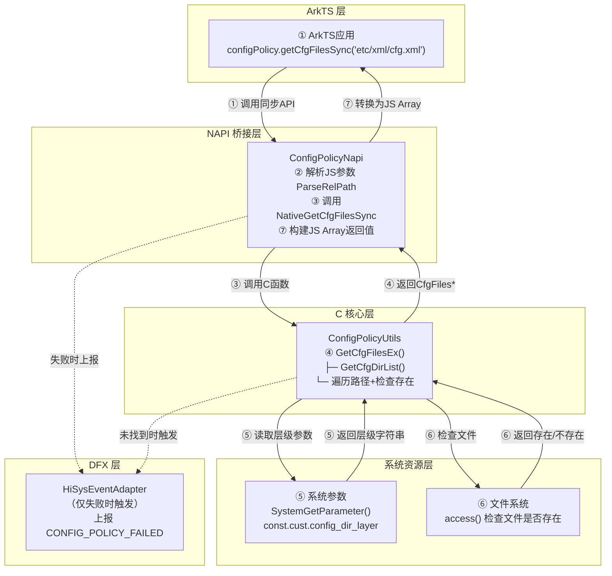

# OpenHarmony 配置策略组件（config_policy）完整开发文档

> 适合人群：无 OpenHarmony 开发经验的新手开发者

---

## 目录

1. [项目概述](#1-项目概述)
2. [OpenHarmony 核心新概念解释](#2-openharmony-核心新概念解释)
3. [项目目录结构详解](#3-项目目录结构详解)
4. [启动入口点](#4-启动入口点)
5. [外部依赖详解](#5-外部依赖详解)
6. [核心数据结构与常量](#6-核心数据结构与常量)
7. [对外接口与能力](#7-对外接口与能力)
8. [二次开发指南](#8-二次开发指南)
9. [UML 图（完整七种）](#9-uml-图完整七种)

---

## 1. 项目概述

**配置策略组件**（英文名 `config_policy`，仓库名 `customization_config_policy`）是华为 OpenHarmony 操作系统"定制化子系统（customization）"下的一个基础组件。

它解决了一个现实问题：**同一款手机，不同运营商版本（如中国移动版、中国联通版、中国电信版）的配置文件可能不同；同一设备，系统层和产品层的配置也需要分层管理，高优先级覆盖低优先级。** 本组件就是负责查找"当前设备应该使用哪一层的哪个配置文件"的工具库。

**核心能力一句话概括：** 给定一个配置文件的相对路径（如 `etc/xml/config.xml`），组件能在系统的多个配置目录中按优先级搜索，返回"最高优先级的那一个"或"所有层级的全部路径"。

---

## 2. OpenHarmony 核心新概念解释

### 2.1 子系统与组件（Subsystem & Component）

OpenHarmony 将整个操作系统功能划分为多个**子系统**（如 `customization`、`telephony`、`multimedia` 等），每个子系统下再细分为多个**组件**。本项目就是 `customization` 子系统下的 `config_policy` 组件。

> 官方文档参考：https://gitee.com/openharmony/docs/blob/master/zh-cn/readme/%E5%AE%9A%E5%88%B6%E5%8C%96%E5%AD%90%E7%B3%BB%E7%BB%9F.md

### 2.2 GN 构建系统（Generate Ninja）

OpenHarmony 不使用传统的 `CMakeLists.txt`，而是使用 **GN**（Generate Ninja）构建系统。项目里所有 `BUILD.gn` 文件就是构建脚本，`*.gni` 是可被其他 `.gn` 文件导入的变量/函数声明文件。

- `BUILD.gn` = 相当于 `CMakeLists.txt`，描述"编译什么文件、链接哪些库、输出什么目标"
- `config_policy.gni` = 全局变量声明，如 `config_policy_api_support = true`
- `ohos_shared_library(...)` = 编译生成一个 `.so` 动态库
- `ohos_static_library(...)` = 编译生成一个 `.a` 静态库
- `external_deps = [...]` = 依赖外部组件

> GN 官方入门：https://gn.googlesource.com/gn/+/main/docs/quick_start.md

### 2.3 NAPI（Node API）

OpenHarmony 的应用开发语言主要是 **ArkTS/TypeScript**，而底层系统库是用 **C/C++** 写的。**NAPI** 是连接两者的桥梁——它允许用 C++ 编写"模块"，暴露给 ArkTS 代码调用，就像 Node.js 的 Native Addon 机制。

```
ArkTS 代码  →  import configPolicy from '@ohos.configPolicy'
                         ↓
              NAPI 桥接层（config_policy_napi.cpp）
                         ↓
              C 核心库（config_policy_utils.c）
```

> NAPI 开发指南：https://developer.huawei.com/consumer/cn/doc/harmonyos-guides-V5/use-napi-process-V5

### 2.4 系统参数（System Parameter）

类似 Android 的 `System Properties`，OpenHarmony 有一套全系统的键值对存储系统。组件通过 `init` 子系统提供的 `SystemGetParameter` / `SystemSetParameter` 函数读写这些参数。

本项目涉及的关键系统参数：

| 参数名 | 含义 | 示例值 |
|--------|------|--------|
| `const.cust.config_dir_layer` | 配置层级目录列表（冒号分隔） | `/system:/chipset:/sys_prod:/chip_prod` |
| `const.cust.follow_x_rules` | Follow X 规则字符串 | `:etc/xml/cfg.xml,10:etc/other.xml,100,...` |
| `telephony.sim.opkey0` | 卡槽0的运营商键值（PLMN） | `46060` |
| `telephony.sim.opkey1` | 卡槽1的运营商键值 | `46061` |
| `const.channelid.<bundleName>` | 应用渠道ID | `vivo_channel_001` |

> `.dac` 文件（`customization.para.dac`）用于设置这些参数的访问权限，`root:root:775` 表示只有 root 用户可写、所有人可读。

### 2.5 配置层级（Config Layer）

这是本组件最核心的概念。OpenHarmony 设备的文件系统被分为多个分区，每个分区的配置优先级不同：

```
优先级从低到高 ──────────────────────────────────>

 /system      /chipset      /sys_prod      /chip_prod
（系统基础）   （芯片商）    （产品方案）    （芯片产品）
优先级最低                                 优先级最高
```

**规则：当同一相对路径的文件在多个层级都存在时，使用优先级最高（最右边）的那个。**

例如，查找 `etc/xml/config.xml`：
- `/system/etc/xml/config.xml` ✓（存在）
- `/chipset/etc/xml/config.xml` ✗（不存在，跳过）
- `/sys_prod/etc/xml/config.xml` ✓（存在，且优先级更高）
- `/chip_prod/etc/xml/config.xml` ✗（不存在，跳过）

则 `GetOneCfgFile` 返回 `/sys_prod/etc/xml/config.xml`。

### 2.6 Follow X 机制

"X"代指可变因素（运营商、SIM卡、PLMN码等）。当需要根据当前插入的SIM卡加载不同配置时，系统会在基础路径中插入一层运营商目录：

```
/sys_prod/etc/carrier/46060/etc/xml/config.xml
           ^^^^^^^^^^^^^^^^^^^
           这是由 Follow X 机制自动插入的运营商子目录
```

### 2.7 HiSysEvent（系统事件）

OpenHarmony 的系统诊断框架，类似于 Android 的 `Statsd`。本组件用它上报两类事件：
- `CONFIG_POLICY_FAILED`（故障事件）：API 调用失败时上报
- `CONFIG_POLICY_EVENT`（统计事件）：API 被调用时上报

### 2.8 HiLog（系统日志）

OpenHarmony 的日志框架，类似 Android 的 `Logcat`。日志域 `0xD001E00` 是本组件的标识符。

### 2.9 CJ（仓颉语言）

华为自研编程语言，本组件通过 **FFI（Foreign Function Interface）** 提供仓颉语言绑定。`cj_config_policy_ffi.so` 就是给仓颉代码调用的动态库。

---

## 3. 项目目录结构详解

```
customization_config_policy/
│
├── BUILD.gn                     # 根构建入口，决定编译哪些子组件
├── bundle.json                  # 组件元数据：名称、版本、依赖、ROM/RAM占用
├── config_policy.gni            # GN全局编译变量（fs前缀、是否支持API）
├── OAT.xml                      # 开源代码审计工具（OSS Audit Tool）配置
├── LICENSE                      # Apache 2.0 许可证
├── README.md / README_zh.md     # 英文/中文使用说明
│
├── common/
│   └── config/
│       └── BUILD.gn             # 代码覆盖率构建配置（仅测试时启用）
│
├── frameworks/                  # ★ 核心实现层
│   ├── config_policy/
│   │   ├── BUILD.gn             # 核心库构建脚本，支持三种系统类型
│   │   ├── src/
│   │   │   └── config_policy_utils.c  # ★★ 所有核心逻辑实现
│   │   └── etc/
│   │       ├── BUILD.gn         # 预置参数文件的构建脚本
│   │       └── customization.para.dac  # 系统参数权限配置
│   └── dfx/                     # 诊断框架（Diagnostics）
│       ├── hisysevent.yaml      # 定义上报事件的格式和类型
│       └── hisysevent_adapter/
│           ├── hisysevent_adapter.h   # DFX事件上报接口声明
│           └── hisysevent_adapter.cpp # DFX事件上报实现
│
├── interfaces/                  # ★ 对外接口层
│   ├── inner_api/include/       # C/C++ 内部接口（供其他C++模块使用）
│   │   ├── config_policy_utils.h  # ★ 主要公开API头文件
│   │   └── config_policy_impl.h   # 内部宏定义（层级常量、MINI系统接口）
│   └── kits/                    # 应用开发接口（JS / CJ）
│       ├── js/
│       │   ├── BUILD.gn
│       │   ├── include/
│       │   │   ├── config_policy_napi.h   # JS NAPI接口类声明
│       │   │   └── custom_config_napi.h   # customConfig 模块类声明
│       │   └── src/
│       │       ├── config_policy_napi.cpp # ★ configPolicy JS模块实现
│       │       └── custom_config_napi.cpp # ★ customConfig JS模块实现
│       └── cj/
│           ├── BUILD.gn
│           └── src/
│               ├── config_policy_ffi.h    # CJ FFI接口声明
│               ├── config_policy_ffi.cpp  # ★ CJ FFI接口实现
│               ├── config_policy_log.h    # CJ模块日志宏
│               └── config_policy_mock.cpp # 预览器(SDK)下的空实现
│
└── test/                        # 测试代码
    ├── unittest/                # 单元测试
    │   ├── BUILD.gn
    │   ├── config_policy_utils_test.h
    │   ├── config_policy_utils_test.cpp  # 11个测试用例
    │   └── resource/ohos_test.xml        # 测试前置/清理脚本
    └── fuzztest/                # 模糊测试（安全测试）
        ├── getcfgfiles_fuzzer/
        ├── getcfgfilesex_fuzzer/
        ├── getonecfgfile_fuzzer/
        └── getonecfgfileex_fuzzer/
```

---

## 4. 启动入口点

> **重要认知：** 本组件**不是一个独立运行的进程或服务**，它是一个**共享库（.so 动态链接库）**，需要被其他模块"装载"后才能使用。因此没有 `main()` 函数这样的传统启动入口。

### 4.1 C/C++ 层入口

其他 C++ 模块通过以下方式使用本组件：
1. 在 `BUILD.gn` 中添加依赖：`deps = ["//base/customization/config_policy/frameworks/config_policy:configpolicy_util"]`
2. 包含头文件：`#include "config_policy_utils.h"`
3. 直接调用函数，如 `GetCfgDirList()`

**核心逻辑真正的"第一步"** 是 `GetCfgDirList()` 函数（`config_policy_utils.c` 第233行），它：
1. `malloc` 分配 `CfgDir` 结构体
2. 调用 `GetCfgDirRealPolicyValue()` 读取系统参数 `const.cust.config_dir_layer`
3. 若参数不存在，使用默认值 `/system:/chipset:/sys_prod:/chip_prod`
4. 按冒号分割字符串，填入 `paths[]` 数组

### 4.2 JavaScript 层入口

**NAPI 模块注册函数就是 JS 层的入口点。**

`config_policy_napi.cpp` 末尾（第543行）：
```cpp
// 这个函数被 __attribute__((constructor)) 标记
// 意味着当 .so 被 dlopen 加载时，它自动执行
extern "C" __attribute__((constructor)) void ConfigPolicyRegister()
{
    napi_module_register(&g_configPolicyModule);
}
```

JS 代码执行 `import configPolicy from '@ohos.configPolicy'` 时，运行时加载 `configpolicy.so`，触发 `ConfigPolicyRegister()` → `ConfigPolicyInit()` → `ConfigPolicyNapi::Init()` 完成模块初始化，向 JS 环境暴露所有函数。

`custom_config_napi.cpp` 末尾（第150行）同理，注册了 `customConfig` 模块。

### 4.3 CJ 层入口

`config_policy_ffi.cpp` 导出以 `CJ_` 前缀开头的 C 函数，仓颉运行时通过 FFI 机制直接调用这些 C 函数。

### 4.4 入口点总结

```
设备启动
    │
    ├─ init 进程读取 customization.para.dac
    │   └─ 设置参数权限：const.cust.="root:root:775"
    │
    ├─ C++ 模块需要配置时
    │   └─ dlopen("libconfigpolicy_util.so") → 调用 GetCfgDirList()
    │
    ├─ ArkTS 应用执行 import configPolicy from '@ohos.configPolicy'
    │   └─ dlopen("configpolicy.so")
    │       └─ __attribute__((constructor)) ConfigPolicyRegister() 自动执行
    │           └─ napi_module_register() → 暴露 getOneCfgFile 等函数给 JS
    │
    └─ 仓颉应用通过 FFI 调用
        └─ dlopen("cj_config_policy_ffi.so") → 调用 CJ_GetOneCfgFile()
```

---

## 5. 外部依赖详解

来源于 `bundle.json` 的 `deps.components` 字段：

| 依赖组件 | 用途 | 使用位置 |
|----------|------|----------|
| `init` / `libbegetutil` | 读取系统参数（`SystemGetParameter`） | `config_policy_utils.c`、`custom_config_napi.cpp` |
| `bounds_checking_function` / `libsec_shared` | 安全字符串函数（`strcpy_s`、`memcpy_s`、`sprintf_s`） | `config_policy_utils.c`、`config_policy_ffi.cpp` |
| `hilog` / `libhilog` | 系统日志输出 | `config_policy_napi.cpp`、`config_policy_log.h` |
| `hisysevent` / `libhisysevent` | 系统事件上报（诊断）| `hisysevent_adapter.cpp` |
| `napi` / `ace_napi` | NAPI JS绑定框架 | `config_policy_napi.cpp`、`custom_config_napi.cpp` |
| `napi` / `cj_bind_ffi` + `cj_bind_native` | CJ FFI绑定框架 | `config_policy_ffi.cpp` |
| `ability_runtime` / `abilitykit_native` + `app_context` | 获取应用Bundle名称 | `custom_config_napi.cpp` |
| `c_utils` / `utils` | C++ 工具类 | `custom_config_napi.cpp` |
| `ipc` / `ipc_single` | 进程间通信 | `custom_config_napi.cpp` |

**依赖关系说明：**

```
config_policy_utils.c
    └─ 依赖: libsec_shared（安全字符串）
             libbegetutil（读系统参数）[仅标准系统]

config_policy_napi.cpp（JS接口）
    └─ 依赖: configpolicy_util（本项目核心库）
             libhilog（日志）
             libhisysevent（事件上报）
             ace_napi（JS桥接）

custom_config_napi.cpp（customConfig JS接口）
    └─ 依赖: ace_napi（JS桥接）
             abilitykit_native（获取BundleName）
             libbegetutil（读系统参数）
             libhilog（日志）

config_policy_ffi.cpp（CJ接口）
    └─ 依赖: configpolicy_util（本项目核心库）
             cj_bind_ffi（CJ FFI框架）
             libhisysevent（事件上报）
```

---

## 6. 核心数据结构与常量

### 6.1 宏常量（`config_policy_utils.h`）

```c
#define MAX_CFG_POLICY_DIRS_CNT   32   // 最多支持32个配置目录层级
#define MAX_PATH_LEN              256  // 文件路径最大长度（字节）

// Follow X 模式常量
#define FOLLOWX_MODE_DEFAULT           0   // 自动从系统参数读取规则
#define FOLLOWX_MODE_NO_RULE_FOLLOWED  1   // 不使用任何Follow X规则
#define FOLLOWX_MODE_SIM_DEFAULT      10   // 跟随默认SIM卡运营商
#define FOLLOWX_MODE_SIM_1            11   // 跟随SIM卡槽1运营商
#define FOLLOWX_MODE_SIM_2            12   // 跟随SIM卡槽2运营商
#define FOLLOWX_MODE_USER_DEFINED    100   // 用户自定义规则（配合extra参数）
```

### 6.2 内部常量（`config_policy_impl.h`）

```c
// 系统参数键名
#define CUST_KEY_POLICY_LAYER  "const.cust.config_dir_layer"
#define CUST_FOLLOW_X_RULES    "const.cust.follow_x_rules"

// 默认配置层级路径（冒号分隔，无前缀时）
#define DEFAULT_LAYER  "/system:/chipset:/sys_prod:/chip_prod"

// MINI系统配置缓冲区大小
#define MINI_CONFIG_POLICY_BUF_SIZE  256
```

### 6.3 数据结构

```c
// 配置文件路径集合
// paths[] 按优先级从低到高排列
// 例：paths[0] = "/system/etc/xml/cfg.xml"
//     paths[1] = "/sys_prod/etc/xml/cfg.xml"  ← 优先级更高
struct CfgFiles {
    char *paths[32];   // 最多32个路径，未使用的槽位为 NULL
};

// 配置目录列表
// paths[] 按优先级从低到高排列
// realPolicyValue 是原始字符串（如 "/system:/chipset:/sys_prod:/chip_prod"）
//   paths[] 中的指针实际指向 realPolicyValue 内部（切割操作）
struct CfgDir {
    char *paths[32];
    char *realPolicyValue;   // 完整的层级字符串，需要 FreeCfgDirList 释放
};
```

**内部辅助结构（仅在 `.c` 文件内部使用）：**

```c
// 字符串分割结果（用于处理逗号分隔的 Follow X 路径）
typedef struct {
    int   segCount;    // 分割出的段数
    char *orgStr;      // 原始字符串（由此结构体负责释放）
    char *segs[1];     // 柔性数组，每个元素指向段的起始位置
} SplitedStr;

// 动态字符串缓冲区（用于变量展开）
typedef struct {
    size_t size;    // 已分配缓冲区大小
    size_t strLen;  // 当前字符串长度
    char  *p;       // 缓冲区指针
} StringHolder;
```

---

## 7. 对外接口与能力

### 7.1 C/C++ 接口（inner_api）

头文件：`interfaces/inner_api/include/config_policy_utils.h`
链接库：`libconfigpolicy_util.so`

#### `GetCfgDirList()`

```c
CfgDir *GetCfgDirList(void);
```

- **功能**：获取当前设备所有配置目录，按优先级从低到高排列
- **返回值**：指向 `CfgDir` 的指针，失败返回 `NULL`
- **注意**：必须调用 `FreeCfgDirList()` 释放内存
- **示例**：

```c
CfgDir *dirs = GetCfgDirList();
if (dirs != NULL) {
    for (int i = 0; i < MAX_CFG_POLICY_DIRS_CNT; i++) {
        if (dirs->paths[i]) printf("%s\n", dirs->paths[i]);
    }
    FreeCfgDirList(dirs);
}
```

#### `GetCfgFiles()`

```c
CfgFiles *GetCfgFiles(const char *pathSuffix);
```

- **功能**：在所有配置目录中搜索指定相对路径的文件，返回所有存在的文件路径（低→高优先级）
- **参数**：`pathSuffix` — 相对路径，如 `"etc/xml/config.xml"`
- **返回值**：指向 `CfgFiles` 的指针，所有层级都没找到时 `paths[]` 全为 `NULL`
- **注意**：必须调用 `FreeCfgFiles()` 释放内存

#### `GetCfgFilesEx()`

```c
CfgFiles *GetCfgFilesEx(const char *pathSuffix, int followMode, const char *extra);
```

- **功能**：`GetCfgFiles` 的扩展版，增加 Follow X 支持
- **参数**：
  - `followMode`：Follow X 模式，使用 `FOLLOWX_MODE_*` 常量
  - `extra`：当 `followMode == FOLLOWX_MODE_USER_DEFINED` 时，传入自定义的子目录规则，支持参数变量展开（如 `"etc/carrier/${telephony.sim.opkey0:-46060}"`）

#### `GetOneCfgFile()`

```c
char *GetOneCfgFile(const char *pathSuffix, char *buf, unsigned int bufLength);
```

- **功能**：获取最高优先级的配置文件路径（`GetCfgFiles` 中优先级最高的那一个）
- **参数**：
  - `buf`：调用方提供的缓冲区，建议长度 `MAX_PATH_LEN`（256字节）
  - `bufLength`：缓冲区长度，**必须 ≥ MAX_PATH_LEN**，否则返回 `NULL`
- **返回值**：指向 `buf` 内部的指针（即 `buf` 本身），未找到时返回 `NULL`
- **注意**：无需释放内存，结果写入了调用方提供的 `buf`

#### `GetOneCfgFileEx()`

```c
char *GetOneCfgFileEx(const char *pathSuffix, char *buf, unsigned int bufLength,
                      int followMode, const char *extra);
```

- **功能**：`GetOneCfgFile` 的扩展版，增加 Follow X 支持

#### `FreeCfgFiles()` / `FreeCfgDirList()`

```c
void FreeCfgFiles(CfgFiles *res);
void FreeCfgDirList(CfgDir *res);
```

- **功能**：释放由 `GetCfgFiles` / `GetCfgDirList` 分配的内存
- **注意**：传入 `NULL` 是安全的（函数内部有判断）

---

### 7.2 JavaScript/ArkTS 接口（`@ohos.configPolicy`）

模块名：`configPolicy`，so 文件：`configpolicy.so`

```typescript
import configPolicy from '@ohos.configPolicy';
```

#### 枚举：`FollowXMode`

| 枚举值 | 数字值 | 含义 |
|--------|--------|------|
| `FollowXMode.DEFAULT` | 0 | 自动读取系统参数中的规则 |
| `FollowXMode.NO_RULE_FOLLOWED` | 1 | 不使用任何跟随规则 |
| `FollowXMode.SIM_DEFAULT` | 10 | 跟随默认SIM卡运营商 |
| `FollowXMode.SIM_1` | 11 | 跟随SIM卡槽1运营商 |
| `FollowXMode.SIM_2` | 12 | 跟随SIM卡槽2运营商 |
| `FollowXMode.USER_DEFINED` | 100 | 自定义（需配合extra参数） |

#### 函数（异步版，返回 Promise 或接受 Callback）

```typescript
// 获取最高优先级配置文件路径
configPolicy.getOneCfgFile(relPath: string): Promise<string>
configPolicy.getOneCfgFile(relPath: string, followMode: number): Promise<string>
configPolicy.getOneCfgFile(relPath: string, followMode: number,
                           extra: string): Promise<string>
configPolicy.getOneCfgFile(relPath: string, callback: AsyncCallback<string>): void

// 获取所有层级配置文件路径
configPolicy.getCfgFiles(relPath: string): Promise<Array<string>>
configPolicy.getCfgFiles(relPath: string, followMode: number): Promise<Array<string>>
configPolicy.getCfgFiles(relPath: string, callback: AsyncCallback<Array<string>>): void

// 获取配置目录列表
configPolicy.getCfgDirList(): Promise<Array<string>>
configPolicy.getCfgDirList(callback: AsyncCallback<Array<string>>): void
```

#### 函数（同步版，直接返回结果）

```typescript
configPolicy.getOneCfgFileSync(relPath: string): string
configPolicy.getOneCfgFileSync(relPath: string, followMode: number): string
configPolicy.getOneCfgFileSync(relPath: string, followMode: number, extra: string): string

configPolicy.getCfgFilesSync(relPath: string): Array<string>
configPolicy.getCfgFilesSync(relPath: string, followMode: number): Array<string>

configPolicy.getCfgDirListSync(): Array<string>
```

**ArkTS 使用示例：**

```typescript
import configPolicy from '@ohos.configPolicy';

// Promise 方式
configPolicy.getOneCfgFile('etc/xml/config.xml').then((filePath: string) => {
  console.log('配置文件路径：' + filePath);
}).catch((err) => {
  console.error('获取失败：' + err.message);
});

// 同步方式（在非UI线程中使用）
let path = configPolicy.getOneCfgFileSync('etc/xml/config.xml');

// 使用 Follow X（按SIM卡槽1运营商查找）
let paths = configPolicy.getCfgFilesSync(
  'etc/xml/config.xml',
  configPolicy.FollowXMode.SIM_1
);
```

---

### 7.3 JavaScript 接口（`@ohos.customization.customConfig`）

模块名：`customConfig`，so 文件：`customconfig.so`

```typescript
import customConfig from '@ohos.customization.customConfig';

// 获取当前应用的渠道ID（同步，无参数）
let channelId: string = customConfig.getChannelId();
```

**工作原理：**
1. 通过 `AbilityRuntime` 获取当前应用的 `bundleName`
2. 检查该 `bundleName` 是否在预加载白名单（`persist.custom.preload.list`）中
3. 若在白名单中，返回空字符串（预加载应用不能获取渠道ID）
4. 否则读取系统参数 `const.channelid.<bundleName>` 返回渠道ID

---

### 7.4 CJ（仓颉）接口

```c
// CJ FFI 函数声明（C 接口，供仓颉调用）
CJ_GetCfgDirList()               → RetDataCArrString（目录列表+状态码）
CJ_GetCfgFiles(relPath: CString) → RetDataCArrString（文件列表+状态码）
CJ_GetOneCfgFile(relPath: CString) → RetDataCString（单个路径+状态码）
```

---

## 8. 二次开发指南

### 8.1 使用本组件（作为其他组件的依赖）

**场景：** 你在开发一个新的 OpenHarmony 子系统组件，需要加载分层配置文件。

**步骤1：** 在你的 `BUILD.gn` 中添加依赖：

```gn
ohos_shared_library("your_component") {
  include_dirs = [
    "//base/customization/config_policy/interfaces/inner_api/include",
  ]
  deps = [
    "//base/customization/config_policy/frameworks/config_policy:configpolicy_util",
  ]
  sources = [ "src/your_component.cpp" ]
}
```

**步骤2：** 在你的 C++ 代码中：

```cpp
#include "config_policy_utils.h"

void LoadMyConfig() {
    // 方式1：获取最高优先级配置文件
    char buf[MAX_PATH_LEN] = {0};
    char *path = GetOneCfgFile("etc/mymodule/config.json", buf, MAX_PATH_LEN);
    if (path != nullptr) {
        // 加载 path 指向的文件
    }

    // 方式2：获取所有层级文件（合并多层配置时使用）
    CfgFiles *files = GetCfgFiles("etc/mymodule/config.json");
    if (files != nullptr) {
        for (int i = 0; i < MAX_CFG_POLICY_DIRS_CNT; i++) {
            if (files->paths[i] != nullptr) {
                // 按优先级从低到高依次处理
            }
        }
        FreeCfgFiles(files);  // ← 必须释放！
    }
}
```

### 8.2 修改默认配置层级

若需要添加新的配置层级（如增加 `/vendor` 分区）：

**方式一：运行时（推荐）** — 在设备初始化阶段，由 `init` 组件设置系统参数：

```bash
# 在设备的 init.cfg 或对应的 .para 文件中添加
const.cust.config_dir_layer=/system:/chipset:/sys_prod:/chip_prod:/vendor
```

**方式二：编译时** — 修改 `interfaces/inner_api/include/config_policy_impl.h`：

```c
#define DEFAULT_LAYER ROOT_PREFIX "/system:" ROOT_PREFIX "/chipset:" \
                      ROOT_PREFIX "/sys_prod:" ROOT_PREFIX "/chip_prod:" \
                      ROOT_PREFIX "/vendor"   // 新增 /vendor
```

### 8.3 添加新的 Follow X 规则

**场景：** 希望 `etc/mymodule/config.xml` 能根据当前运营商加载不同配置。

**运行时方式（推荐）：** 在设备出厂配置中写入系统参数：

```
# 格式：:relPath,mode[,extra][:]
const.cust.follow_x_rules=:etc/mymodule/config.xml,10
```

含义：对 `etc/mymodule/config.xml`，使用 SIM_DEFAULT（模式10）规则。

**调用方式（代码中）：** 如果不希望依赖系统参数，可以用 `USER_DEFINED` 模式：

```c
char buf[MAX_PATH_LEN] = {0};
// 在基础路径下先查 etc/carrier/46060/ 再查 etc/carrier/46061/
char *path = GetOneCfgFileEx(
    "etc/mymodule/config.xml",
    buf, MAX_PATH_LEN,
    FOLLOWX_MODE_USER_DEFINED,
    "etc/carrier/46060,etc/carrier/46061"  // 逗号分隔的子目录列表
);
```

也支持变量展开（从系统参数取值）：

```c
// ${telephony.sim.opkey0:-46060} 表示：
// 读取 telephony.sim.opkey0 的值，若不存在则用默认值 46060
char *path = GetOneCfgFileEx(
    "etc/mymodule/config.xml",
    buf, MAX_PATH_LEN,
    FOLLOWX_MODE_USER_DEFINED,
    "etc/carrier/${telephony.sim.opkey0:-46060}"
);
```

### 8.4 添加新的 JS 接口

若需要新增一个 JS 可调用的 API，参考以下步骤：

1. 在 `config_policy_napi.h` 中声明新的静态方法
2. 在 `config_policy_napi.cpp` 的 `Init()` 函数中用 `DECLARE_NAPI_FUNCTION` 注册
3. 实现对应的 Native 函数（参考 `NativeGetOneCfgFile` 的写法）
4. 根据是否异步，选择走 `HandleAsyncWork` 流程或直接同步返回

### 8.5 为 MINI 系统（LiteOS-M）移植

LiteOS-M 是 OpenHarmony 面向超轻量设备（如 MCU）的内核，不支持文件系统参数，需要特殊处理：

```c
// 在你的板级移植代码中实现弱符号函数
void TrigSetMiniConfigPolicy() {
    // 从你的配置存储中读取策略字符串
    SetMiniConfigPolicy("/data:/system");
}
```

也可以在启动时直接调用：

```c
SetMiniConfigPolicy("你的层级字符串");
```

### 8.6 运行测试

```bash
# 在 OpenHarmony 编译环境中编译测试
./build.sh --product-name <your_product> --build-target ConfigPolicyUtilsTest

# 推送到设备并执行
hdc shell aa test -b com.ohos.configpolicytest -a TestAbility -s unittest true
```

---

## 9. UML 图（完整七种）

> 以下 UML 图使用 **Mermaid** 语法绘制，可在以下工具中渲染：
> - VS Code 安装 "Markdown Preview Mermaid Support" 插件
> - 在线渲染：https://mermaid.live
> - GitHub/GitLab Markdown 文件中直接渲染

---

### 9.1 类图（Class Diagram）

描述项目中所有结构体、类及其关系。



---

### 9.2 组件图（Component Diagram）

描述项目的模块划分和编译输出产物之间的依赖关系。



---

### 9.3 时序图一：`GetOneCfgFile` C 函数调用流程



### 9.4 时序图二：JS 异步接口（Promise）调用流程



### 9.5 时序图三：`getChannelId` 调用流程



---

### 9.6 用例图（Use Case Diagram）



---

### 9.7 状态图（State Diagram）

描述 `GetOneCfgFileEx` 函数执行过程中的内部状态转换。



---

### 9.8 活动图（Activity Diagram）

描述 `GetCfgFilesEx` 函数的完整执行流程（收集所有层级文件）。

```mermaid
flowchart TD
    Start([开始: GetCfgFilesEx]) --> A{pathSuffix == NULL?}
    A -- 是 --> RN1([返回 NULL])
    A -- 否 --> B[调用 GetCfgDirList\n获取所有目录]

    B --> C{malloc CfgDir\n成功?}
    C -- 否 --> RN2([返回 NULL])
    C -- 是 --> D[malloc CfgFiles\n初始化为零]

    D --> E{malloc CfgFiles\n成功?}
    E -- 否 --> F[FreeCfgDirList\n释放dirs]
    F --> RN3([返回 NULL])
    E -- 是 --> G[调用 GetFollowXPathByMode\n获取FollowX子路径列表]

    G --> H[初始化: i=0, index=0]

    H --> LOOP{i < 32 且\nindex < 32?}
    LOOP -- 否 --> DONE[FreeCfgDirList\nFreeSplitedStr]

    LOOP -- 是 --> I{dirs.paths_i\n== NULL?}
    I -- 是 --> INCI[i++]
    INCI --> LOOP

    I -- 否 --> J["构建基础路径:\nbuf = dirs.paths[i] + '/' + pathSuffix"]
    J --> K{access(buf)\n文件存在?}
    K -- 是 --> L["files.paths[index++] = strdup(buf)"]
    K -- 否 --> M

    L --> M{有FollowX规则?\nj=0}
    M -- 否 --> INCI2[i++]
    INCI2 --> LOOP

    M -- 是 --> FXLOOP{j < segCount 且\nindex < 32?}
    FXLOOP -- 否 --> INCI2

    FXLOOP -- 是 --> N["构建FollowX路径:\nbuf = dirs.paths[i] + '/' + segs[j] + '/' + pathSuffix"]
    N --> O{access(buf)\n文件存在?}
    O -- 是 --> P["files.paths[index++] = strdup(buf)"]
    O -- 否 --> INCJ[j++]
    P --> INCJ
    INCJ --> FXLOOP

    DONE --> RETURN([返回 CfgFiles*\n调用方需 FreeCfgFiles 释放])
```

---

### 9.9 协作图（Collaboration / Communication Diagram）

描述各模块在一次典型调用中的协作关系和消息传递顺序。



---

## 附录

### A. 常见问题

**Q：为什么 `GetOneCfgFile` 返回 `NULL`？**

- `pathSuffix` 为 `NULL` → 参数错误
- `bufLength < MAX_PATH_LEN`（256）→ 缓冲区太小
- 所有配置层级中都没有该文件 → 文件不存在

**Q：`FreeCfgFiles` 和 `FreeCfgDirList` 能传 `NULL` 吗？**

可以，函数内有 `if (res == NULL) return;` 保护。

**Q：`CfgDir->paths[]` 和 `realPolicyValue` 的关系是什么？**

- `realPolicyValue` 是分配的内存块（如 `"/system:/chipset:/sys_prod:/chip_prod"`）
- `paths[]` 内的指针直接指向 `realPolicyValue` 内部（原地切割），**不是独立的内存块**
- 这就是为什么 `FreeCfgDirList` 只需释放 `realPolicyValue` 和 `res` 本身，不需要释放每个 `paths[i]`

**Q：`CfgFiles->paths[]` 的内存和 `CfgDir` 不同？**

- `CfgFiles->paths[i]` 是用 `strdup()` 独立复制的，每个都是独立内存块
- `FreeCfgFiles` 需要逐个 `free(paths[i])`，然后 `free(res)`

### B. 资源链接

- OpenHarmony 官方文档：https://docs.openharmony.cn
- configPolicy JS API 文档：https://developer.huawei.com/consumer/cn/doc/harmonyos-references-V5/js-apis-configpolicy-V5
- GN 构建系统教程：https://gn.googlesource.com/gn/+/main/docs/
- NAPI 开发指南：https://developer.huawei.com/consumer/cn/doc/harmonyos-guides-V5/use-napi-process-V5
- OpenHarmony 代码仓库：https://gitee.com/openharmony/customization_config_policy
