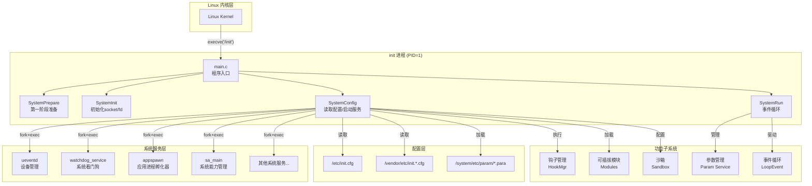
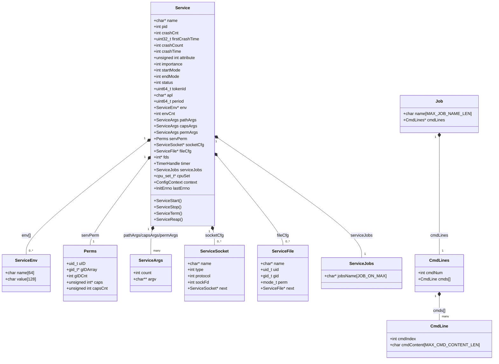
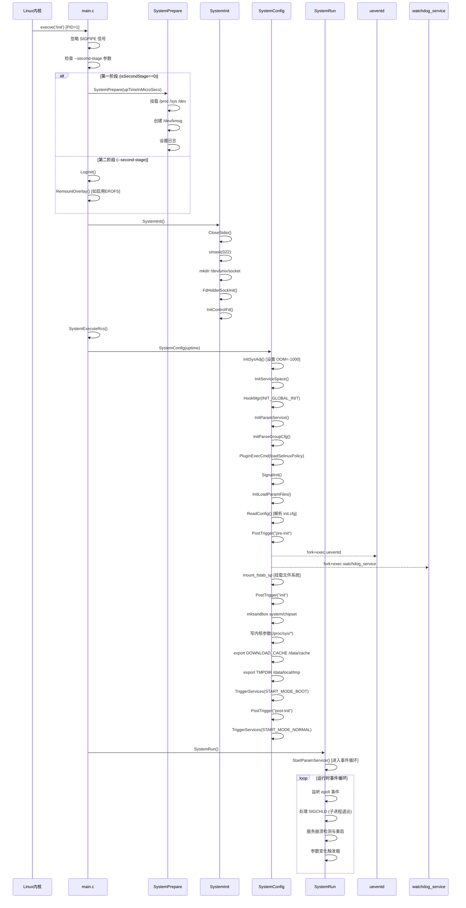
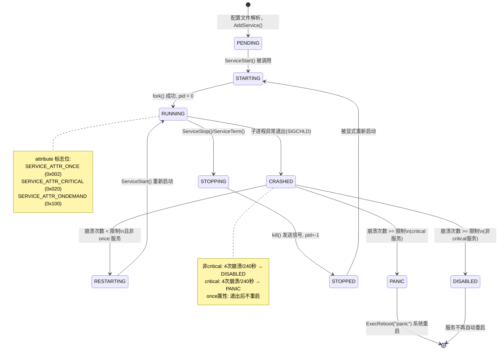
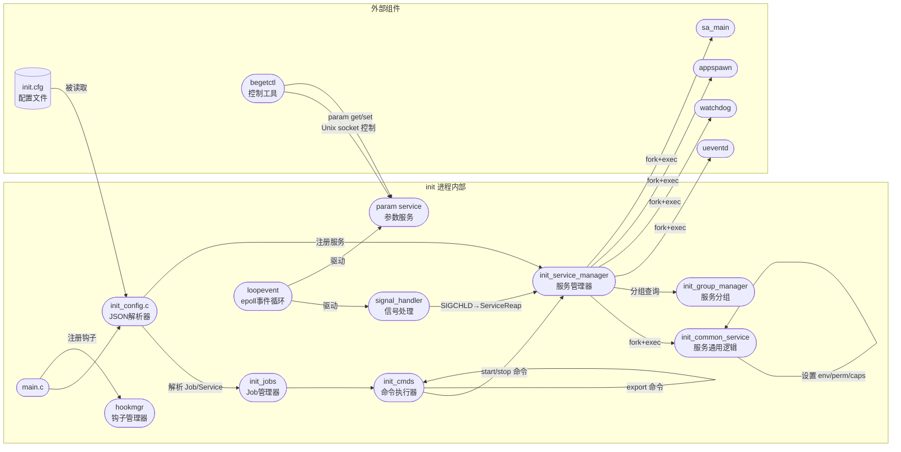
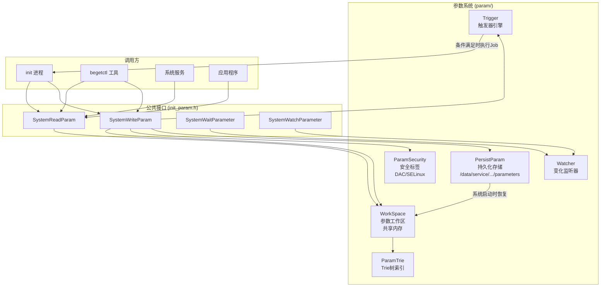
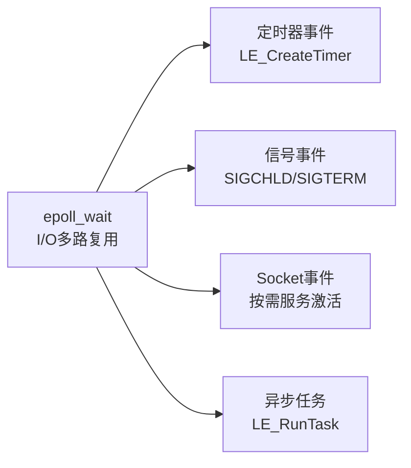
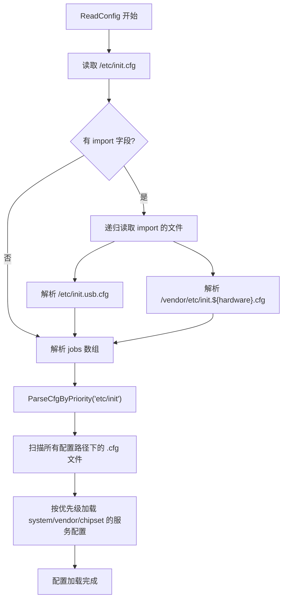
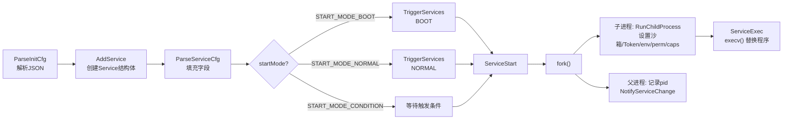

# OpenHarmony startup_init 子系统开发文档

> **适用版本**：OpenHarmony (本文档基于 `D:\projects\startup_init` 源码分析生成)
> **作者备注**：本文面向 OpenHarmony / C++ 开发新手，所有专有概念均附有解释。

---

## 目录

1. [子系统概述](#1-子系统概述)
2. [专有概念速查](#2-专有概念速查)
3. [目录结构详解](#3-目录结构详解)
4. [架构设计与UML图](#4-架构设计与uml图)
   - 4.1 [整体架构图](#41-整体架构图)
   - 4.2 [核心数据结构类图](#42-核心数据结构类图)
   - 4.3 [启动时序图](#43-启动时序图)
   - 4.4 [服务生命周期状态机](#44-服务生命周期状态机)
   - 4.5 [组件交互图](#45-组件交互图)
   - 4.6 [参数系统架构图](#46-参数系统架构图)
5. [核心模块详解](#5-核心模块详解)
   - 5.1 [init 主进程](#51-init-主进程)
   - 5.2 [ueventd 设备事件守护进程](#52-ueventd-设备事件守护进程)
   - 5.3 [watchdog 看门狗服务](#53-watchdog-看门狗服务)
   - 5.4 [begetctl 控制工具](#54-begetctl-控制工具)
   - 5.5 [param 参数管理系统](#55-param-参数管理系统)
   - 5.6 [loopevent 事件循环框架](#56-loopevent-事件循环框架)
6. [配置文件详解](#6-配置文件详解)
   - 6.1 [init.cfg 主配置文件](#61-initcfg-主配置文件)
   - 6.2 [服务配置格式](#62-服务配置格式)
   - 6.3 [配置文件加载顺序](#63-配置文件加载顺序)
7. [启动流程深度解析](#7-启动流程深度解析)
8. [服务管理机制](#8-服务管理机制)
   - 8.1 [服务注册与启动](#81-服务注册与启动)
   - 8.2 [服务崩溃与重启策略](#82-服务崩溃与重启策略)
   - 8.3 [按需启动服务](#83-按需启动服务)
9. [环境变量机制](#9-环境变量机制)
10. [安全机制](#10-安全机制)
11. [二次开发实战：添加全局环境变量](#11-二次开发实战添加全局环境变量)
    - 11.1 [方案一：export 命令（推荐）](#111-方案一export-命令推荐)
    - 11.2 [方案二：修改 init_firststage.c](#112-方案二修改-init_firststagec)
    - 11.3 [方案三：自定义 .cfg 文件](#113-方案三自定义-cfg-文件)
    - 11.4 [验证方法](#114-验证方法)
12. [关键源码文件索引](#12-关键源码文件索引)
13. [参考资料](#13-参考资料)

---

## 1. 子系统概述

`startup_init` 是 OpenHarmony 操作系统的**第一个用户态进程**（PID=1），其地位等同于 Linux 的 `systemd` 或 Android 的 `init`。

当 Linux 内核完成自身初始化后，会启动 `/init` 可执行文件，此后整个用户态的所有进程都由它直接或间接派生（`fork`）出来。

### 核心职责

| 职责 | 说明 |
|------|------|
| **系统初始化** | 挂载文件系统、创建设备节点、设置内核参数 |
| **服务管理** | 解析配置文件，启动/停止/监控所有系统服务 |
| **进程回收** | 作为所有孤儿进程的父进程，负责回收退出的子进程（`waitpid`） |
| **参数服务** | 维护全局系统参数（类似 Android Property Service） |
| **设备管理** | 通过 ueventd 响应内核设备插拔事件 |
| **安全初始化** | 配置 Linux Capabilities、SELinux 策略、沙箱 |

---

## 2. 专有概念速查

> 本节解释文档中出现的专有术语，帮助新手快速理解。

### 操作系统概念

| 概念 | 解释 |
|------|------|
| **PID=1** | 进程 ID 为 1 的进程。Linux 内核启动后执行的第一个用户态程序。系统中所有其他进程都是它的后代。 |
| **fork/exec** | Unix 创建子进程的标准方式。`fork()` 复制当前进程，`exec()` 在子进程中替换程序映像。 |
| **SIGCHLD** | 当子进程退出时，内核向父进程发送的信号。init 通过监听此信号来知道哪个服务崩溃了。 |
| **epoll** | Linux 高效的 I/O 多路复用机制，可同时监听多个文件描述符（socket、管道等）的事件。 |
| **umask** | 进程创建文件时使用的默认权限掩码。022 表示新建文件权限为 644。 |
| **Capability** | Linux 细粒度权限机制，将 root 权限拆分成多个独立能力（如 CAP_NET_ADMIN 管理网络）。 |
| **SELinux** | 安全增强型 Linux，提供强制访问控制（MAC），防止进程越权访问资源。 |
| **cgroup** | 控制组，Linux 内核特性，用于限制和统计进程组的资源使用（CPU、内存等）。 |
| **AF_UNIX socket** | Unix 域套接字，用于同一台机器上进程间通信（IPC）。 |
| **udev/uevent** | 内核设备管理机制。当硬件插拔时，内核通过 netlink socket 发送 uevent 消息。 |

### OpenHarmony 专有概念

| 概念 | 解释 |
|------|------|
| **SystemParam** | OpenHarmony 全局系统参数，类似 Android 的 `getprop/setprop`。以 `key=value` 形式存储。 |
| **Job（作业）** | init 配置中的任务单元，包含一系列顺序执行的命令。如 `pre-init`、`init`、`post-init`。 |
| **Trigger（触发器）** | 在满足特定条件（如参数变化）时自动执行某个 Job 的机制。 |
| **Sandbox（沙箱）** | 通过 mount namespace 隔离进程的文件系统视图，增强安全性。 |
| **AccessToken** | OpenHarmony 访问控制令牌，用于权限管理。 |
| **APL（Ability Privilege Level）** | 能力特权级别，控制服务可以申请的权限范围。 |
| **begetctl** | OpenHarmony 的服务控制命令行工具，类似 Android 的 `start/stop` 命令。 |
| **HookMgr** | 钩子管理器，允许模块在启动阶段特定时刻插入自定义逻辑。 |
| **GN（Generate Ninja）** | OpenHarmony 使用的构建系统元工具，生成 Ninja 构建文件。`.gn` 是其配置文件。 |

---

## 3. 目录结构详解

```
D:\projects\startup_init\
│
├── services/                   # 核心服务实现
│   ├── init/                   # init 主进程源码
│   │   ├── main.c              # ★ 程序入口 (PID=1 从这里开始)
│   │   ├── include/            # 公共头文件
│   │   ├── init_common_cmds.c  # ★ 通用命令实现(export/mkdir/chmod等)
│   │   ├── init_common_service.c # ★ 服务通用属性(环境变量/权限/Caps)
│   │   ├── init_service_manager.c # ★ 服务注册、启动、停止管理
│   │   ├── init_service_socket.c  # Socket 管理
│   │   ├── init_service_file.c    # 文件描述符管理
│   │   ├── init_group_manager.c   # 服务分组与依赖管理
│   │   ├── init_capability.c      # Linux Capability 设置
│   │   ├── init_config.c          # JSON 配置文件解析
│   │   ├── bootstagehooker.c      # 启动阶段钩子注册
│   │   ├── lite/               # 轻量版本 (Mini/Small 系统)
│   │   │   ├── init.c          # 轻量版 init 主逻辑
│   │   │   ├── init_jobs.c     # 轻量版 Job 处理
│   │   │   ├── init_cmds.c     # 轻量版命令实现
│   │   │   └── init_signal_handler.c # 信号处理
│   │   └── standard/           # 标准版本 (Standard 系统)
│   │       ├── init.c          # ★ 标准版 init 主逻辑
│   │       ├── init_cmds.c     # 标准版命令(含参数替换)
│   │       ├── init_firststage.c  # 第一阶段初始化(sanitizer env vars)
│   │       ├── init_mount.c    # 文件系统挂载
│   │       ├── device.c        # 设备节点创建
│   │       └── fd_holder_service.c # 文件描述符持有服务
│   │
│   ├── begetctl/               # 命令行控制工具
│   │   ├── main.c              # begetctl 入口
│   │   ├── service_control.c   # 服务控制命令
│   │   └── param_cmd.c         # 参数操作命令
│   │
│   ├── param/                  # 系统参数管理
│   │   ├── base/               # 参数基础数据结构 (Trie 树)
│   │   ├── manager/            # 参数工作区管理
│   │   ├── persist/            # 参数持久化存储
│   │   ├── trigger/            # 参数变化触发器
│   │   ├── watcher/            # 参数变化监听器
│   │   └── include/            # 参数系统头文件
│   │
│   ├── loopevent/              # 事件循环框架(epoll封装)
│   │   ├── loop/               # 主循环实现
│   │   ├── timer/              # 定时器管理
│   │   ├── signal/             # 信号处理
│   │   ├── socket/             # Socket 事件
│   │   └── task/               # 异步任务
│   │
│   ├── modules/                # 可插拔功能模块
│   │   ├── bootchart/          # 启动性能分析
│   │   ├── bootevent/          # 启动事件记录
│   │   ├── crashhandler/       # 崩溃处理
│   │   ├── selinux/            # SELinux 集成
│   │   ├── seccomp/            # Seccomp 系统调用过滤
│   │   ├── sandbox/            # 沙箱管理
│   │   └── trace/              # 追踪模块
│   │
│   ├── utils/                  # 工具函数库
│   │   ├── init_utils.c        # 文件/字符串工具
│   │   ├── init_hashmap.c      # 哈希表实现
│   │   └── list.c              # 链表实现
│   │
│   ├── log/                    # 日志系统
│   ├── sandbox/                # 沙箱配置文件
│   └── etc/                    # ★ 配置文件目录
│       ├── init.cfg            # ★ 主配置文件(Jobs定义)
│       ├── init.usb.cfg        # USB 相关配置
│       ├── init.reboot.cfg     # 重启序列配置
│       ├── ueventd.cfg         # ueventd 服务配置
│       ├── console.cfg         # 控制台服务配置
│       └── watchdog.cfg        # 看门狗服务配置
│
├── ueventd/                    # 设备事件守护进程
│   ├── ueventd_main.c          # ueventd 入口
│   ├── ueventd.c               # 核心事件处理
│   ├── ueventd_device_handler.c # 设备事件处理
│   └── ueventd_read_cfg.c      # 配置文件解析
│
├── watchdog/                   # 看门狗服务
│   └── init_watchdog.c
│
├── remount/                    # 重挂载和覆盖文件系统
│   ├── remount.c
│   └── remount_overlay.c
│
├── interfaces/                 # 对外接口
│   └── innerkits/              # 系统内部接口
│       └── include/param/
│           └── init_param.h    # ★ 参数系统公共API
│
├── initsync/                   # 初始化同步模块
├── test/                       # 测试套件
│   ├── unittest/               # 单元测试
│   ├── autotest/               # 自动化测试
│   └── fuzztest/               # 模糊测试
│
├── BUILD.gn                    # 顶层构建配置
├── begetd.gni                  # 构建变量定义
└── bundle.json                 # 组件元数据
```

---

## 4. 架构设计与UML图

> **UML图说明**：以下图表使用 [Mermaid](https://mermaid.js.org/) 语法编写，可在支持 Mermaid 的 Markdown 渲染器（如 GitHub、VS Code Mermaid 插件）中直接预览。

### 4.1 整体架构图



### 4.2 核心数据结构类图



### 4.3 启动时序图



### 4.4 服务生命周期状态机



### 4.5 组件交互图



### 4.6 参数系统架构图



---

## 5. 核心模块详解

### 5.1 init 主进程

**入口文件**：`services/init/main.c`

init 的 `main()` 函数极为简洁，按顺序调用四个核心函数：

```c
// services/init/main.c:26
int main(int argc, char * const argv[])
{
    // 1. 忽略断管信号（防止写入关闭的pipe时进程退出）
    (void)signal(SIGPIPE, SIG_IGN);

    // 2. 判断是否是第二阶段（由 --second-stage 参数决定）
    if (argc > 1 && strcmp(argv[1], "--second-stage") == 0) {
        isSecondStage = 1;
    }

    // 安全检查：只有 PID=1 才能运行
    if (getpid() != INIT_PROCESS_PID) { return 0; }

    // 3. 四个核心阶段
    SystemPrepare(upTimeInMicroSecs);   // 第一阶段：内核态到用户态过渡
    SystemInit();                        // 初始化：创建socket/fd
    SystemExecuteRcs();                  // 执行RC脚本
    SystemConfig(uptime);               // 配置阶段：解析cfg/启动服务
    SystemRun();                         // 运行阶段：进入事件循环

    return 0;
}
```

**两阶段启动机制**：

- **第一阶段**（无 `--second-stage`）：在早期 rootfs 中运行，负责挂载实际的 system/vendor 分区
- **第二阶段**（带 `--second-stage`）：在 system 分区上运行，完成完整的系统初始化

这类似 Android 的 first/second stage init，目的是先挂载文件系统，再从完整的 system 分区继续执行。

### 5.2 ueventd 设备事件守护进程

**入口文件**：`ueventd/ueventd_main.c`

ueventd 通过 **netlink socket** 监听内核发送的设备事件（uevent），自动创建/删除 `/dev` 下的设备节点。

当你插入 USB 设备或内核加载驱动时，内核会通过 netlink 广播 uevent 消息，ueventd 收到后：
1. 解析消息中的设备信息（设备类型、主次设备号）
2. 在 `/dev` 下创建对应的设备文件（如 `/dev/block/sda`）
3. 设置正确的文件权限和 SELinux 上下文

### 5.3 watchdog 看门狗服务

**文件**：`watchdog/init_watchdog.c`

看门狗是一种硬件/软件机制，要求程序周期性地"喂狗"（发送心跳）。如果程序卡死没有喂狗，看门狗就会触发系统重启。

init 的看门狗主要用于检测系统是否卡在启动过程中，防止设备因软件 bug 永远无法正常启动。

### 5.4 begetctl 控制工具

**入口文件**：`services/begetctl/main.c`

begetctl 是开发调试时常用的命令行工具，通过 Unix socket 与 init 进程通信：

```bash
# 启动服务
begetctl start <service_name>

# 停止服务
begetctl stop <service_name>

# 重启服务
begetctl restart <service_name>

# 读取系统参数
begetctl param get ohos.boot.hardware

# 设置系统参数
begetctl param set debug.myapp.loglevel 5

# 列出所有服务
begetctl dump_service all

# 查看启动耗时
begetctl bootchart stop
```

### 5.5 param 参数管理系统

**目录**：`services/param/`

参数系统是一个进程间共享的键值存储，类似 Android 的 Property Service：

| 特性 | 说明 |
|------|------|
| **存储结构** | Trie 树（字典树），支持快速前缀查询 |
| **共享机制** | 通过共享内存（mmap）实现跨进程共享 |
| **安全控制** | 基于 DAC（用户/组权限）和 SELinux 标签控制读写权限 |
| **持久化** | 特定前缀的参数（如 `persist.`）会持久化保存到存储器 |
| **触发器** | 参数变化时可触发 Job 执行（如内核参数动态调整） |

**公共 API**（`interfaces/innerkits/include/param/init_param.h`）：
```c
// 读取参数
int SystemReadParam(const char *name, char *value, unsigned int *len);

// 写入参数
int SystemWriteParam(const char *name, const char *value);

// 等待参数变为特定值
int SystemWaitParameter(const char *name, const char *value, int timeout);

// 监听参数变化
int SystemWatchParameter(const char *keyprefix, ParameterChangePtr change, void *context);
```

### 5.6 loopevent 事件循环框架

**目录**：`services/loopevent/`

loopevent 是对 Linux epoll 的封装，为 init 提供异步事件处理能力：



---

## 6. 配置文件详解

### 6.1 init.cfg 主配置文件

**位置**：`services/etc/init.cfg`（运行时在 `/etc/init.cfg`）

init.cfg 是 JSON 格式，包含两个顶层字段：

```json
{
    "import": [
        "/etc/init.usb.cfg",
        "/vendor/etc/init.${ohos.boot.hardware}.cfg"
    ],
    "jobs": [
        {
            "name": "pre-init",
            "cmds": [
                "write /proc/sys/kernel/sysrq 0",
                "start ueventd",
                "mkdir /data 0755 root root"
            ]
        },
        {
            "name": "init",
            "cmds": [
                "export DOWNLOAD_CACHE /data/cache",
                "export TMPDIR /data/local/tmp"
            ]
        },
        {
            "name": "post-init",
            "cmds": [
                "trigger early-fs",
                "trigger boot"
            ]
        }
    ]
}
```

**Job 名称规范**：

| Job 名称 | 触发时机 | 主要用途 |
|----------|----------|----------|
| `pre-init` | 最早阶段 | 启动 ueventd、挂载文件系统 |
| `init` | 中间阶段 | 创建沙箱、设置内核参数、导出环境变量 |
| `post-init` | 较晚阶段 | 触发 early-fs/fs/boot 等事件链 |
| `fs` | 文件系统就绪 | 挂载相关操作 |
| `post-fs` | /system 挂载后 | 初始化全局密钥、创建数据目录 |
| `late-fs` | 晚期文件系统 | 调试目录权限 |
| `post-fs-data` | /data 可读写后 | 创建 /data 下的目录结构 |
| `early-boot` | 早期启动 | 早期服务启动 |
| `boot` | 正常启动 | 写最终内核参数 |

### 6.2 服务配置格式

服务定义在各自的 `.cfg` 文件中（不在 `init.cfg` 主文件）：

```json
{
    "services": [{
        "name": "my_service",
        "path": ["/system/bin/my_service", "--config", "/etc/my_service.conf"],
        "uid": "system",
        "gid": ["system", "shell"],
        "once": 0,
        "importance": 1,
        "caps": ["CAP_NET_ADMIN", "CAP_NET_BIND_SERVICE"],
        "cpucore": [0, 1],
        "critical": [1, 4, 240],
        "sandbox": 1,
        "secon": "u:r:my_service:s0",
        "socket": [{
            "name": "my_service_socket",
            "family": "AF_UNIX",
            "type": "SOCK_STREAM",
            "protocol": "default",
            "permissions": "0666",
            "uid": "system",
            "gid": "system"
        }],
        "file": [{
            "name": "/dev/my_device",
            "uid": "system",
            "gid": "system",
            "perm": "0644"
        }],
        "jobs": {
            "on-boot": "boot",
            "on-start": "services:my_service",
            "on-stop": "services:my_service_stop",
            "on-restart": "services:my_service_restart"
        },
        "ondemand": false,
        "writepid": ["/dev/cpuset/foreground/tasks"]
    }]
}
```

**关键字段说明**：

| 字段 | 类型 | 说明 |
|------|------|------|
| `name` | string | 服务名，最长 32 字节，全局唯一 |
| `path` | array | 可执行文件路径及参数列表 |
| `uid/gid` | string/array | 运行时用户 ID 和组 ID |
| `once` | 0/1 | 1=一次性服务，退出后不重启 |
| `importance` | 0/1 | 1=重要服务，崩溃触发系统重启 |
| `caps` | array | 所需的 Linux Capabilities |
| `critical` | array | `[1, 崩溃次数, 时间窗口秒]`，达到限制后重启系统 |
| `sandbox` | 0/1 | 是否启用沙箱隔离 |
| `ondemand` | bool | 是否按需启动（socket 激活模式） |
| `secon` | string | SELinux 安全上下文 |

### 6.3 配置文件加载顺序



**说明**：`${ohos.boot.hardware}` 是参数替换语法，运行时会替换为实际的硬件平台名称（如 `rk3568`），从而加载对应的 vendor 配置。

---

## 7. 启动流程深度解析

### 完整启动时序（标准版本）

```
[内核启动]
    → execve('/init') ← PID=1 诞生

[第一阶段: SystemPrepare]
    → mount /proc, /sys, /dev (内核虚拟文件系统)
    → 创建 /dev/kmsg (内核日志设备)
    → LogInit() (初始化日志)

[初始化: SystemInit]
    → CloseStdio() (关闭标准输入输出)
    → umask(022) (设置默认文件权限掩码)
    → mkdir /dev/unix/socket (创建Unix socket目录)
    → FdHolderSockInit() (创建fd持有服务socket)
    → InitControlFd() (初始化控制socket)

[配置阶段: SystemConfig]
    → InitSysAdj() (将 init 的 OOM killer 分数设为 -1000，防止被杀死)
    → InitServiceSpace() (初始化服务存储空间)
    → HookMgr(INIT_GLOBAL_INIT) (全局初始化钩子)
    → InitParamService() (启动参数服务)
    → preLoadSelinuxPolicy() (预加载SELinux策略)
    → loadSelinuxPolicy() (加载SELinux策略) ← 关键安全检查点
    → SignalInit() (设置 SIGCHLD 信号处理器)
    → InitLoadParamFiles() (加载 .para 参数文件)
    → ReadConfig() (解析 init.cfg 及所有import的文件)
    → IsEnableSandbox() (检查是否启用沙箱)

    -- 触发 pre-init Job --
    → PostTrigger("pre-init")
        ├── start ueventd  ← fork+exec /system/bin/ueventd
        ├── start watchdog_service ← fork+exec 看门狗
        ├── mount_fstab_sp /vendor/etc/fstab.* (挂载 /data 等分区)
        ├── restorecon /data (恢复SELinux上下文)
        ├── mkdir /data/service/* (创建数据目录)
        └── load_persist_params (加载持久化参数)

    -- 触发 init Job --
    → PostTrigger("init")
        ├── mksandbox system/chipset (创建系统/芯片沙箱)
        ├── 写内核参数: sched/vm/net 等 /proc/sys/* 文件
        ├── symlink /proc/self/fd/0-2 (标准I/O符号链接)
        ├── export DOWNLOAD_CACHE /data/cache ← 全局环境变量
        ├── setrlimit RLIMIT_NICE 40 / RLIMIT_NOFILE 32768
        ├── mount pstore (性能存储)
        ├── hostname localhost / domainname localdomain
        └── export TMPDIR /data/local/tmp ← 全局环境变量

    -- 启动 BOOT 模式服务 --
    → TriggerServices(START_MODE_BOOT)
        └── appspawn, sa_main 等核心服务

    -- 触发 post-init Job --
    → PostTrigger("post-init")
        └── trigger early-fs → fs → post-fs → late-fs → post-fs-data
            → firmware_mounts_complete → early-boot → boot

    -- 启动 NORMAL 模式服务 --
    → TriggerServices(START_MODE_NORMAL)

[运行阶段: SystemRun]
    → StartParamService()
        └── 进入 epoll 事件循环
            ├── 监听 SIGCHLD (子进程退出)
            ├── 处理服务崩溃/重启
            ├── 处理参数变化触发器
            └── 处理 Socket 按需服务激活
```

---

## 8. 服务管理机制

### 8.1 服务注册与启动

服务从 JSON 配置文件解析后注册到 `g_serviceSpace`（全局服务空间），通过以下流程启动：



### 8.2 服务崩溃与重启策略

当 init 收到 `SIGCHLD` 信号，调用 `waitpid()` 得知子进程退出，然后调用 `ServiceReap()`：

```
ServiceReap() 逻辑：
├── 通知服务状态变化 (SERVICE_STOPPED)
├── 如果服务有 NEED_STOP 标志 → 不重启 (正常停止)
├── 如果服务有 ONCE 标志 → 不重启 (一次性服务)
├── 如果服务是 PERIOD 服务 → 设置定时器后重启
├── 如果服务是按需服务 → 重新监听socket，等待下次激活
├── 如果服务有 CRITICAL 标志:
│   └── CalculateCrashTime(service, crashTime, crashCount)
│       ├── 在 crashTime 秒内崩溃 crashCount 次 → ExecReboot("panic") 重启系统
│       └── 否则 → 重启服务
└── 普通服务:
    ├── 在 crashTime 秒内崩溃 crashCount 次 → 停止重启（等240秒后重试）
    └── 否则 → 立即重启
```

**默认限制**（定义于 `init_service_manager.c`）：
- `CRITICAL_DEFAULT_CRASH_TIME = 240`（秒）
- `CRITICAL_DEFAULT_CRASH_COUNT = 4`（次）

### 8.3 按需启动服务

按需服务（`ondemand: true`）不在启动时创建进程，而是创建 socket 并等待客户端连接。当有客户端连接时，init 收到 epoll 事件，才真正启动服务进程。这样可以减少启动时的内存和CPU消耗。

---

## 9. 环境变量机制

startup_init 中有三种设置环境变量的途径，理解它们的区别对二次开发至关重要：

### 机制一：export 命令（Job级别）

在 init.cfg 的 Job 中使用 `export` 命令：

```json
{
    "name": "init",
    "cmds": [
        "export TMPDIR /data/local/tmp",
        "export DOWNLOAD_CACHE /data/cache"
    ]
}
```

**原理**：`export` 命令调用 `setenv(name, value, 1)` 设置 init 进程自身的环境变量。所有后续 `fork()` 出来的子进程都会继承这些环境变量。

**实现代码**（`services/init/init_common_cmds.c` 中的 `DoExport` 函数）：
```c
static void DoExport(const struct CmdArgs *ctx)
{
    INIT_CHECK_ONLY_RETURN(ctx != NULL && ctx->argc >= 2 && ctx->argv[0] != NULL && ctx->argv[1] != NULL);
    int ret = setenv(ctx->argv[0], ctx->argv[1], 1);  // 1 = overwrite existing
    INIT_CHECK_ONLY_ELOG(ret == 0, "DoExport: set %s=%s failed, err: %d", ctx->argv[0], ctx->argv[1], errno);
}
```

> **关键理解**：`export` 设置的是 **init 进程的环境变量**。由于所有服务都是 init `fork()` 出来的，子进程天然继承父进程的环境变量。这是让环境变量对"所有程序进程"生效的核心机制。

### 机制二：服务级别的 environment 配置

在服务配置中为特定服务设置环境变量（只对该服务生效）：

```json
{
    "name": "my_service",
    "path": ["/system/bin/my_service"],
    "environment": [
        {"name": "MY_VAR", "value": "hello"},
        {"name": "LOG_LEVEL", "value": "debug"}
    ]
}
```

**实现代码**（`services/init/init_common_service.c:420`）：
```c
static void SetServiceEnv(Service *service)
{
    INIT_CHECK(service->env != NULL, return);
    for (int i = 0; i < service->envCnt; i++) {
        if (strlen(service->env[i].name) > 0 && strlen(service->env[i].value) > 0) {
            int ret = setenv(service->env[i].name, service->env[i].value, 1);
        }
    }
}
```

这段代码在子进程（fork之后、exec之前）中调用，只影响当前服务。

### 机制三：init_firststage.c 中硬编码

**文件**：`services/init/standard/init_firststage.c`

在第一阶段初始化时直接用 `setenv()` 设置，主要用于 sanitizer 调试工具：

```c
setenv("ASAN_OPTIONS", "include=/system/etc/asan.options", 1);
setenv("TSAN_OPTIONS", "include=/system/etc/tsan.options", 1);
setenv("HWASAN_OPTIONS", "include=/system/etc/hwasan.options", 1);
```

### 机制四：Socket/File 自动环境变量

init 自动为按需服务的 socket 生成环境变量（`FDSTORE_SERVICE_SOCKET_<name>=<fd>`），供服务启动后找到预建的 socket。

---

## 10. 安全机制

### Linux Capabilities

每个服务在配置中声明所需的 Capabilities：

```json
"caps": ["CAP_NET_ADMIN", "CAP_NET_BIND_SERVICE", "CAP_SETUID"]
```

在 `SetCapabilities()` 函数中（`services/init/init_common_service.c`），通过 `capset()` 系统调用设置。不声明某个 Capability 的服务就无法执行对应的特权操作。

**常用 Capabilities**：

| Capability | 说明 |
|-----------|------|
| `CAP_NET_ADMIN` | 管理网络配置 |
| `CAP_NET_BIND_SERVICE` | 绑定 1024 以下端口 |
| `CAP_SYS_BOOT` | 允许重启系统 |
| `CAP_KILL` | 向其他进程发送信号 |
| `CAP_SETUID/CAP_SETGID` | 切换 UID/GID |

### SELinux 集成

- 每个服务通过 `secon` 字段声明运行时的 SELinux 上下文
- init 在 fork 之后调用 `SetSubInitContext()` 设置子进程的 SELinux 标签
- SELinux 策略文件通过 `loadSelinuxPolicy` 模块在启动时加载

### 沙箱隔离

通过 `system-sandbox.json` 和 `chipset-sandbox.json` 定义沙箱规则，使用 Linux `mount namespace` 实现文件系统级别的隔离。

---

## 11. 二次开发实战：添加全局环境变量

> **目标**：在开机过程中添加一个对系统所有程序进程都生效的环境变量。

### 原理分析

在 Unix/Linux 中，环境变量通过 **进程继承** 传递：子进程会自动继承父进程的所有环境变量。由于 init（PID=1）是所有用户态进程的祖先，**只要在 init fork 出任何子进程之前设置环境变量，该变量就会传递给所有后代进程**。

因此，最关键的时机是：在 init 解析 `init.cfg` 并开始 `fork` 服务**之前或期间**（init Job 阶段）设置环境变量。

### 11.1 方案一：export 命令（推荐）

**优点**：无需修改 C 代码，配置驱动，最安全，官方支持的方式。
**适用场景**：设置普通字符串类型的环境变量。

#### 步骤一：在 init.cfg 的 `init` Job 中添加 export 命令

修改文件：`services/etc/init.cfg`

```json
{
    "name" : "init",
    "cmds" : [
        "mksandbox system",
        "mksandbox chipset",
        ...
        "export TMPDIR /data/local/tmp",

        "export MY_GLOBAL_VAR my_custom_value",
        "export APP_ENV production",
        "export CUSTOM_LIB_PATH /system/lib64/mylib"
    ]
}
```

**说明**：
- `export` 命令格式：`export <变量名> <变量值>`
- 变量名不能包含空格，变量值如果包含空格需要特殊处理
- 建议放在 `init` Job（不是 `pre-init`），此时文件系统已挂载，路径已可用

#### 步骤二：确认执行时机

查看 `services/init/standard/init.c` 中的 `SystemConfig()` 函数：

```c
void SystemConfig(const char *uptime)
{
    // ... 其他初始化 ...

    ReadConfig();  // 解析 init.cfg

    // 触发 pre-init Job (此时开始fork第一批进程)
    PostTrigger(EVENT_TRIGGER_BOOT, "pre-init", strlen("pre-init"));
    // 触发 init Job (export 命令在这里执行)
    PostTrigger(EVENT_TRIGGER_BOOT, "init", strlen("init"));
    // 启动 BOOT 模式服务 (ueventd, appspawn 等)
    TriggerServices(START_MODE_BOOT);
    // 触发 post-init Job
    PostTrigger(EVENT_TRIGGER_BOOT, "post-init", strlen("post-init"));
    // 启动 NORMAL 模式服务
    TriggerServices(START_MODE_NORMAL);
}
```

> **重要**：`export` 命令在 `init` Job 中执行，此时已有 `ueventd` 和 `watchdog_service` 运行（它们在 `pre-init` 中启动），**这两个服务不会继承到 `init` Job 中设置的环境变量**。
>
> 如果需要让所有进程都继承，应将 export 命令放在 `pre-init` Job 的最开始，在 `start ueventd` 之前。

#### 将 export 放到 pre-init（让所有服务继承）

```json
{
    "name" : "pre-init",
    "cmds" : [
        "export MY_GLOBAL_VAR my_custom_value",
        "export APP_ENV production",

        "write /proc/sys/kernel/sysrq 0",
        "start ueventd",
        "start watchdog_service",
        ...
    ]
}
```

这样 `MY_GLOBAL_VAR` 会在 ueventd 启动前就设置好，所有后续进程都能继承。

### 11.2 方案二：修改 init_firststage.c

**优点**：代码级控制，可以根据运行时条件决定是否设置。
**适用场景**：需要动态计算环境变量值，或根据硬件/配置条件设置。

修改文件：`services/init/standard/init_firststage.c`

```c
// 在现有代码的适当位置（建议在第一批服务 fork 之前）添加：
static void SetGlobalEnvironments(void)
{
    // 设置自定义全局环境变量
    setenv("MY_GLOBAL_VAR", "my_custom_value", 1);   // 1 = 覆盖已存在的值
    setenv("APP_ENV", "production", 1);

    // 也可以读取系统参数来决定值
    char paramValue[PARAM_VALUE_LEN_MAX] = {0};
    unsigned int paramLen = PARAM_VALUE_LEN_MAX;
    if (SystemReadParam("const.product.model", paramValue, &paramLen) == 0) {
        setenv("DEVICE_MODEL", paramValue, 1);
    }
}
```

然后在合适的位置调用此函数（在 `SystemPrepare` 或第一阶段早期）。

### 11.3 方案三：自定义 .cfg 文件

为了避免直接修改 `init.cfg`（主配置文件），可以创建一个新的配置文件，通过 import 机制加载。

#### 步骤一：创建新配置文件

创建文件：`vendor/etc/init.myconfig.cfg`

```json
{
    "jobs": [{
        "name": "pre-init",
        "cmds": [
            "export MY_GLOBAL_VAR my_custom_value",
            "export APP_ENV production"
        ]
    }]
}
```

#### 步骤二：在主配置文件中 import

修改 `services/etc/init.cfg`，在 `import` 数组中添加：

```json
{
    "import": [
        "/etc/init.usb.cfg",
        "/etc/init.usb.configfs.cfg",
        "/vendor/etc/init.${ohos.boot.hardware}.cfg",
        "/vendor/etc/init.myconfig.cfg"
    ],
    "jobs": [...]
}
```

#### 步骤三：更新构建配置

修改对应的 `BUILD.gn` 文件，将新配置文件打包进系统镜像：

```python
# 在相应的 BUILD.gn 中添加
ohos_prebuilt_etc("init_myconfig_cfg") {
    source = "init.myconfig.cfg"
    relative_install_dir = "init"
    part_name = "startup"
    subsystem_name = "startup"
    install_images = ["system"]
}
```

### 11.4 验证方法

编译并刷入系统后，可以通过以下方式验证环境变量是否生效：

```bash
# 方法一：使用 begetctl 读取参数（间接验证）
begetctl param get ohos.boot.time.init

# 方法二：通过 shell 查看进程环境变量
# 找到任意一个运行中的进程 PID，读取其环境变量
cat /proc/<pid>/environ | tr '\0' '\n' | grep MY_GLOBAL_VAR

# 方法三：在 hilog 中搜索 export 命令执行日志
hilog | grep "DoExport"

# 方法四：编写测试程序
// test_env.c
#include <stdio.h>
#include <stdlib.h>
int main() {
    const char *val = getenv("MY_GLOBAL_VAR");
    printf("MY_GLOBAL_VAR = %s\n", val ? val : "(not set)");
    return 0;
}
```

### 注意事项

1. **变量名规范**：使用大写字母和下划线，避免与系统变量冲突。
2. **变量值长度**：服务级 `ServiceEnv` 的 `value` 最长 128 字节（`MAX_ENV_VALUE=128`），Job 级的 export 受命令行长度限制（`MAX_CMD_CONTENT_LEN`）。
3. **时机选择**：越早 export，继承的进程越多。放在 `pre-init` 最前面可以让包括 ueventd 在内的所有进程继承。
4. **安全考虑**：不要在环境变量中存放敏感信息（密钥、密码），环境变量可以被进程轻易读取和修改。
5. **沙箱进程**：运行在沙箱中的进程仍然会继承环境变量，沙箱只隔离文件系统视图。
6. **`execve` 替换**：如果一个进程调用 `execve` 时显式传入新的环境变量数组（`envp` 参数），继承来的变量会被覆盖，这取决于具体服务的实现。

---

## 12. 关键源码文件索引

| 文件路径 | 重要程度 | 主要职责 |
|----------|----------|----------|
| `services/init/main.c` | ★★★★★ | 程序入口，4个核心阶段调用 |
| `services/etc/init.cfg` | ★★★★★ | 主配置文件，Job 和 import 定义 |
| `services/init/standard/init.c` | ★★★★★ | SystemInit/SystemConfig/SystemRun 实现 |
| `services/init/init_common_cmds.c` | ★★★★★ | export/mkdir/chmod 等命令实现 |
| `services/init/init_common_service.c` | ★★★★★ | 服务fork逻辑、环境变量设置 |
| `services/init/init_service_manager.c` | ★★★★☆ | 服务注册、崩溃检测、重启策略 |
| `services/init/include/init_service.h` | ★★★★☆ | Service 结构体定义 |
| `services/init/standard/init_firststage.c` | ★★★☆☆ | 第一阶段初始化、sanitizer 环境变量 |
| `services/param/` | ★★★★☆ | 系统参数管理（完整目录） |
| `services/loopevent/loop/le_loop.c` | ★★★☆☆ | epoll 事件循环主体 |
| `services/init/init_group_manager.c` | ★★★☆☆ | 服务分组和依赖管理 |
| `services/init/bootstagehooker.c` | ★★★☆☆ | 启动阶段钩子注册 |
| `ueventd/ueventd_main.c` | ★★★☆☆ | ueventd 守护进程入口 |
| `watchdog/init_watchdog.c` | ★★☆☆☆ | 系统看门狗 |
| `interfaces/innerkits/include/param/init_param.h` | ★★★★☆ | 参数系统公共 API |

---

## 13. 参考资料

### OpenHarmony 官方文档

| 资料 | 链接 |
|------|------|
| OpenHarmony 官方文档中心 | https://docs.openharmony.cn |
| startup_init 子系统说明 | https://gitee.com/openharmony/startup_init |
| 系统服务开发指南 | https://docs.openharmony.cn/pages/v4.0/zh-cn/device-dev/subsystems/subsys-boot-init-service.md |
| init 配置文件说明 | https://docs.openharmony.cn/pages/v4.0/zh-cn/device-dev/subsystems/subsys-boot-init-cfg.md |
| 参数系统开发指南 | https://docs.openharmony.cn/pages/v4.0/zh-cn/device-dev/subsystems/subsys-boot-syspara.md |

### Linux/C 基础参考

| 资料 | 说明 |
|------|------|
| Linux man pages - fork(2) | `man 2 fork` 或 https://man7.org/linux/man-pages/man2/fork.2.html |
| Linux man pages - exec(3) | `man 3 exec` |
| Linux man pages - setenv(3) | `man 3 setenv` - 环境变量设置API |
| Linux Capabilities 完整列表 | https://man7.org/linux/man-pages/man7/capabilities.7.html |
| Linux epoll 说明 | `man 7 epoll` |
| cJSON 库文档 | https://github.com/DaveGamble/cJSON |

### 相关概念深入学习

| 主题 | 推荐资料 |
|------|----------|
| Unix 进程环境变量继承 | 《UNIX环境高级编程（APUE）》第7章 |
| Linux init 系统原理 | 《Linux系统编程》第13章 |
| SELinux 基础 | https://access.redhat.com/documentation/en-us/red_hat_enterprise_linux/8/html/using_selinux |
| Linux Namespace 与容器 | https://man7.org/linux/man-pages/man7/namespaces.7.html |
| Android init（参考设计） | https://android.googlesource.com/platform/system/core/+/refs/heads/main/init/README.md |

---

*文档由源码分析自动生成，最后更新：2026-03-01*
*源码路径：`D:\projects\startup_init`*
